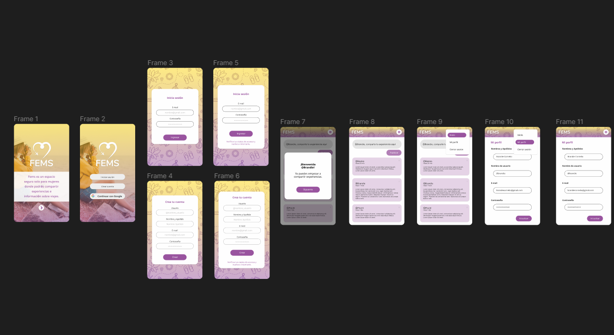

# Creando una Red Social: "FEMS"

## Índice

* [1. Introducción](#1-introducción)
* [2. Resumen del proyecto](#2-resumen-del-proyecto)
* [3. Prototipos](#3-Prototipos)
* [4. Test de usabilidad](#4-Test-de-usabilidad)
* [5.  Historias de Usuario](#5-Historias-de-Usuario)

## 1. Introducción

Fems es un espacio para compartir información de hospedajes seguros, destinos, presupuestos, experiencias, alertas, consejos en seguridad y sobre todo un entorno donde se podrá compartir los miedos y prejuicios que enfrentamos como mujeres al momento de viajar solas.

## 2. Resumen del proyecto
Esta red social tiene la estructura de una Single page Aplication(SPA), se empleó el routeado con windows.location y cuenta con un diseño responsive, partiendo de mobile first.
Se utilizó firebase para autenticar usuarios y guardar la base de datos de las publicaciones.
Las usuarias podrán elegir entre iniciar sesión con google o creando una cuenta con correo electrónico, la cual se verificará por email para poder iniciar sesión. Podrá realizar publicaciones,  editar y eliminar los de su autoría e interactuar dando "Me gusta" a todas las publicaciones. 

## 3. Prototipos
### 3.1 Prototipos de baja fidelidad
Una vez definidos los datos que íbamos a trabajar hicimos una maquetacion del posible diseño, procurando una distibución visualmente agradable, se puede ver nuestro prototipo de baja fidelidad en nuestra siguiente imagen: 

### 3.2 Prototipos de alta fidelidad 

#### 3.2.1 Prototipo de alta fidelidad mobile
Se realizo el diseño de alta fidelidad para mobile utilizando Figma, se puede visualizar en el siguiente link.
https://www.figma.com/proto/ZzfUD8WtnVGxiNRDmlAr5M/Social-Network---Prototipo-de-baja-fidelidad---Female-Solo-Travel-App?node-id=306%3A1414&scaling=scale-down&page-id=39%3A19&starting-point-node-id=306%3A1414

#### 3.2.2 Prototipo de alta fidelidad desktop
Se realizo el diseño de alta fidelidad para desktop utilizando Figma, se puede visualizar en el siguiente link.
https://www.figma.com/proto/ZzfUD8WtnVGxiNRDmlAr5M/Social-Network---Prototipo-de-baja-fidelidad---Female-Solo-Travel-App?node-id=306%3A1243&scaling=scale-down&page-id=13%3A5&starting-point-node-id=306%3A1243

### 4. Test de usabilidad:
Realizamos test de usabilidad para conocer a nuestras usuarias y sus preferencias con respecto a nuestra red social. Las conclusiones son las siguientes:
- Del 100% de las encuestadas, el 50% ha viajado sola y el otro 50% no lo ha hecho pero piensa hacerlo, por loq ue todas forman parte de nuestro grupo de usuarias.
- Les parece interesante esta red social, ya que podrán compartir de ida y vuelta información segura sobre viajes (pasajes, hospedaje, tours, movilidad, etc,) .
- El 75% de las usuarias inicia sesión directamente con Google, por lo que tener un botón de Google es indispensable en nuestra SPA. 
- Eligieron el logo blanco ya que resalta más, y así pueden identificar la marca (se aprecia mejor el avión).
- En cuanto al fondo de la página de registro en adelante, eligieron la opción con patrón ya que marca una diferencia clara entre la bienvenida y la inscripción/inicio de sesión, y causa menos distracción.

##  5. Historias de Usuario
### 5.1 Usuarias: 
Usuaria 1:
Mujeres de Latam con experiencia viajando solas que busquen conocer su país y otros (nuevas culturas, paisajes, etc). Desean compartir sus experiencias e incentivar a otras mujeres a viajar solas brindándoles tips y recomendaciones sobre vuelos, seguridad, los mejores lugares para conocer, etc.
Usuaria 2: 
Mujeres sin experiencia viajando solas que deseen salir de la rutina y conocer nuevos lugares (a los que por motivos laborales, familiares, etc no pudieron ir antes). Están en busca de su primer viaje por lo que buscan información sobre presupuesto, seguridad, actividades a desarrollar, etc.

### 5.2 Historia de Usuario 1:
**Yo como** como usuaria **quiero poder** registrarme en una red social dirigida a viajeras **para** compartir y encontrar información relevante.
**Criterios de aceptación:**
- Al ingresar a la red social, la usuaria debe ver una breve descripción informativa.
- Al iniciar la usuaria debe de ver 3 botones:
  - Iniciar sesión: En esta sección se le solicitará ingresar con su correo ya registrado y su contraseña.
  - Crear cuenta: En esta sección se le solicitará su nombre de usuario, nombre y apellido, país, correo y contraseña.
  - Continuar con Google: Cuando la usuaria haga clic, se abrirá un popup en la que podrá ingresar con su cuenta de Google.
- La usuaria verá el mensaje de Bienvenida. 
**Definición de terminado:**
- Debe ser una SPA.
- Debe ser responsive, y adaptarse a otros dispositivos.
- Deben haber recibido code review de al menos una compañera de otro equipo.
- Testearon manualmente buscando errores e imperfecciones simples.
- Hicieron pruebas de usabilidad e incorporaron el feedback de los usuarios como mejoras.
- Desplegaron su aplicación y etiquetaron la versión (git tag).

### 5.3 Historia de Usuario 2:
**Yo como** usuaria de fems **quiero poder** ver y compartir información (texto) sobre destinos y algunos tips **para** que más mujeres se animen a viajar.
**Criterios de aceptación:**
- La usuaria al ingresar al inicio, debe poder visualizar un campo en el que podrá escribir el texto que desee, y poder hacerle clic al botón publicar.
- La usuaria debería poder ver las publicaciones de las demás usuarias, junto con su nombre de usuario y la fecha y hora de publicación.

### 5.4 Historia de Usuario 3:
**Yo como** usuaria de fems **quiero poder** editar las publicaciones que he realizado **para** corregir y/o actualizar la información escrita.
**Criterios de aceptación:**
- La usuaria al ver sus publicaciones debería encontrar un pequeño botón “editar” que al hacer clic le permite editar la publicación, para luego hacer clic en el botón “publicar / guardar cambios”.

### 5.5 Historia de Usuario 4:
**Yo como** usuaria de fems **quiero poder** eliminar las publicaciones que he realizado **para** corregir / gestionar mis publicaciones.
**Criterios de aceptación:**
- La usuaria debería poder encontrar una opción para eliminar la publicación realizada.
- La usuaria tendría que confirmar la eliminación de la publicación (aparecerá mensaje y el botón “confirmar”).

### 5.6 Historia de Usuario 5:
**Yo como** usuaria de fems **quiero poder** darle “like” a las publicaciones de mi interés y ver cuantas usuarias le dieron “like” también **para** saber qué publicación tiene mayor aceptación y hacer mi contenido.
Criterios de aceptación:
- La usuaria debería encontrar una botón de “like” en las publicaciones que aparezcan en el inicio, y poder darle clic solo una vez.
- La usuaria debería poder ver la cantidad de “likes” que tiene la publicación.
